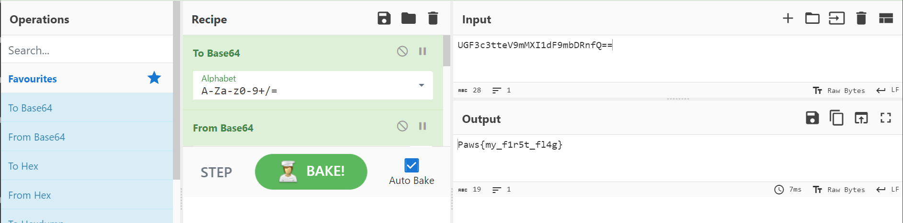
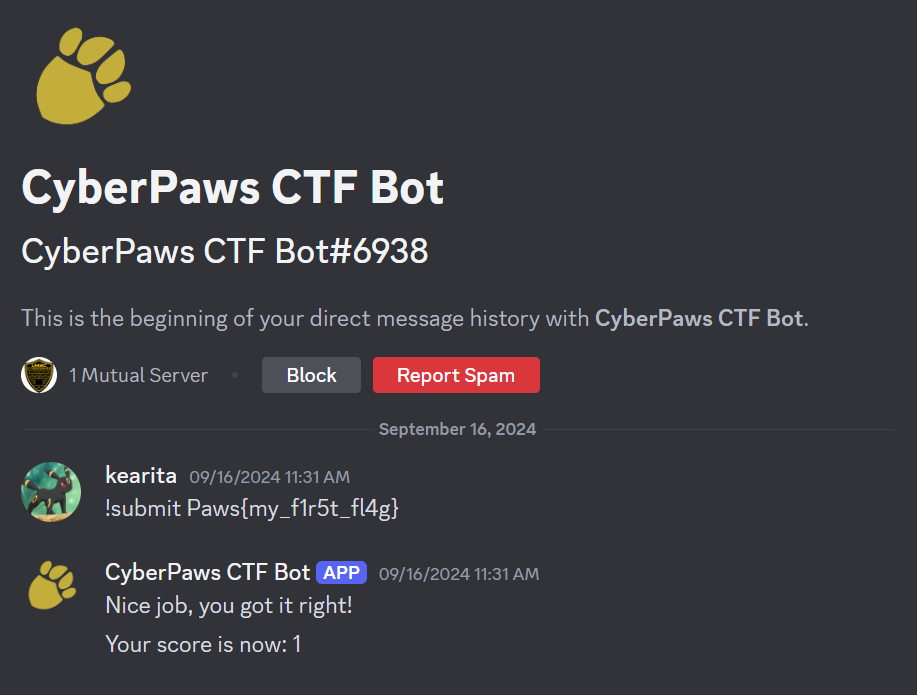

## CyberPaws Challenge 1
This was the first challenge released by the CyberDawgs Club. It was very introductory.

### Steps taken
1. Based on the image I went to the CyberPaws Bot profile on Discord

There's a message that clearly states the flag.
`UGF3c3tteV9mMXI1dF9mbDRnfQ==`
- Because the string looks like it needed to be decoded, I noticed the double equal signs `==` and figured that it was in base 64.
2. I used a base64 decoder online from *cyberchef.org*

The flag was `Paws{my_f1r5t_fl4g}`

### Submission

